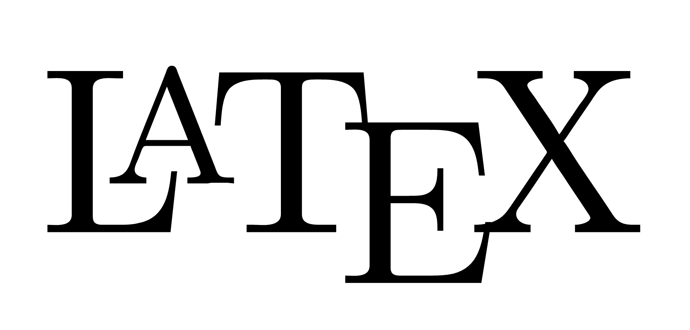

### What's UP [&uarr;](README.md)? 

Hey there!!!

I am Venkatesh, a programming enthusiast, also working with Data Science and Machine Learning.

## Connect with me

#### SOCIAL PROFILES (To Talk)

#### GAMING PROFILES

## Skill Set

 
 

<table class="table table-borderless">
<tr>
<td valign="top" width="33%">

### Programming Languages
 

</td>
<td valign="top" width="33%">

### Frameworks
 

</td>
<td valign="top" width="33%">

### Database systems
 

</td>
</tr>

<tr style="background-color:#ffffff">
<td valign="top" width="33%">

### VCS
 

</td>
<td valign="top" width="33%">

### Virtualization
 

</td>
<td valign="top" width="33%">

### Templating
 

</td>
</tr>
</table>

 
 

## Workspace Spec

 

## Github Stats

 
 

 

## Interesting Projects

https://github.com/gautamkrishnar/blog-post-workflow
https://github.com/rishavanand/github-profilinator

 

## Github Activity
<!-- BLOG-POST-LIST:START -->
- [venkateshwara-gopisetti created a branch master in venkateshwara-gopisetti/python_for_statistical_analysis](https://github.com/venkateshwara-gopisetti/python_for_statistical_analysis/compare/master)
- [venkateshwara-gopisetti created a repository venkateshwara-gopisetti/python_for_statistical_analysis](https://github.com/venkateshwara-gopisetti/python_for_statistical_analysis//)
- [venkateshwara-gopisetti pushed to master in venkateshwara-gopisetti/general_utilities](https://github.com/venkateshwara-gopisetti/general_utilities/compare/f049eb8a5a...bc4dee6b7e)
- [venkateshwara-gopisetti created a branch master in &lpar;deleted&rpar;](https://github.com/venkateshwara-gopisetti/animeout-downloader/compare/master)
- [venkateshwara-gopisetti created a repository venkateshwara-gopisetti/animeout-downloader](https://github.com/venkateshwara-gopisetti/animeout-downloader//)
<!-- BLOG-POST-LIST:END -->

## Resources

Badges from [shields.io](https://shields.io/)

Icons from [media set at this project by Rishav Anand](https://github.com/rishavanand/github-profilinator)

<!-- 
 (seriously broken) -->
